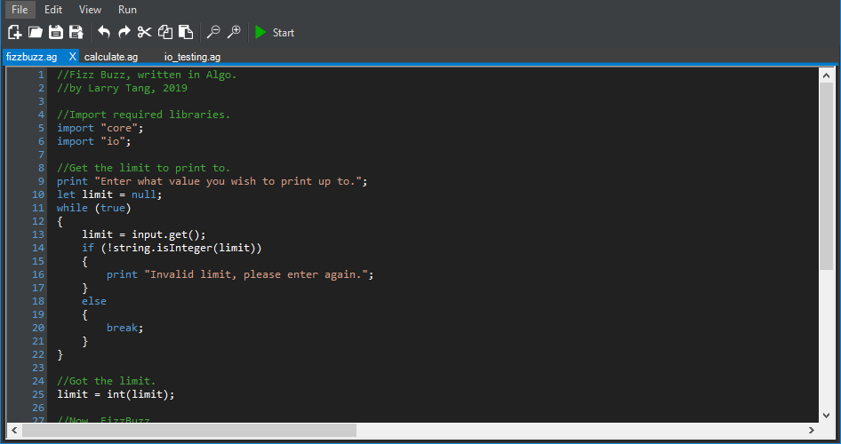

  

*A fast and responsive text editor, built from the ground up for Algo.*
## Introduction
Rhythm is a text editor/IDE built for the Algo language, with runtime debugging features, syntax highlighting and autocompletion. The editor also supports many other languages, which can be seen on the Wiki, [here.](https://github.com/c272/rhythm/wiki)

To use the Algo runtime and debugging features of this editor, you must have the Algo interpreter installed, which you can get from the language's repository, [here.]() Make sure it's added to `PATH`, and you have rebooted your system at least once since doing so. If you do have issues with these features, you can submit an [issue to this repository.](https://github.com/c272/rhythm/issues)

## Building Rhythm
To build the Rhythm editor, you need at least Visual Studio 2017 or higher. Since it uses Winforms, this **does not** compile on Linux apart from fringe cases. You can attempt to build on Linux through the use of Mono, however it is not officially supported.

Building in "Debug" mode is recommended for all contributions to the update branch, but if you are using it for a personal modification, using "Release" is a better option, for size and compute efficiency.

## How do I use this?
Simply launch `rhythm.exe` and the editor GUI will pop up. It works in the same way as nearly every other text editor available. If you want to run an Algo script, make sure it's been saved/loaded first, then click the "Start" button in the toolbar or on the button strip at the top of the window.

If you're looking for information on how to program in Algo, you can view the Algo wiki [here.](https://github.com/c272/algo-lang/wiki)

## Screenshots
Here are some example screenshots of the program, for your viewing pleasure.

